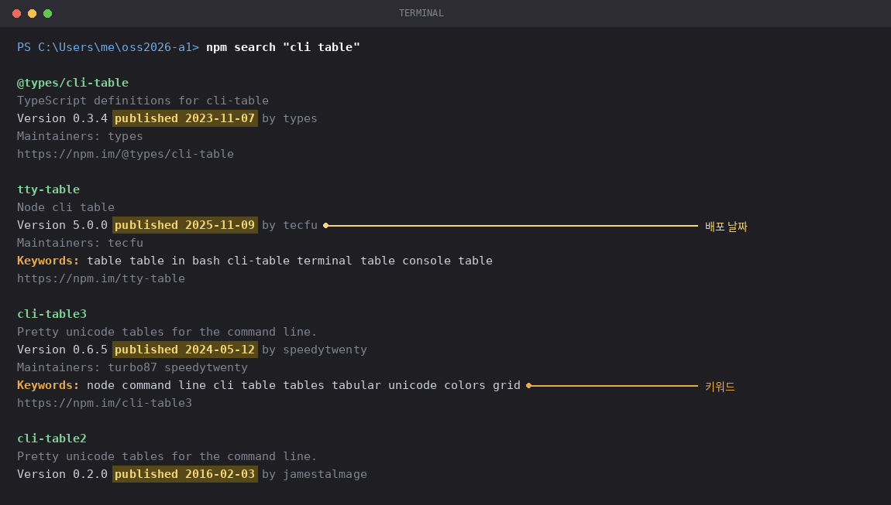
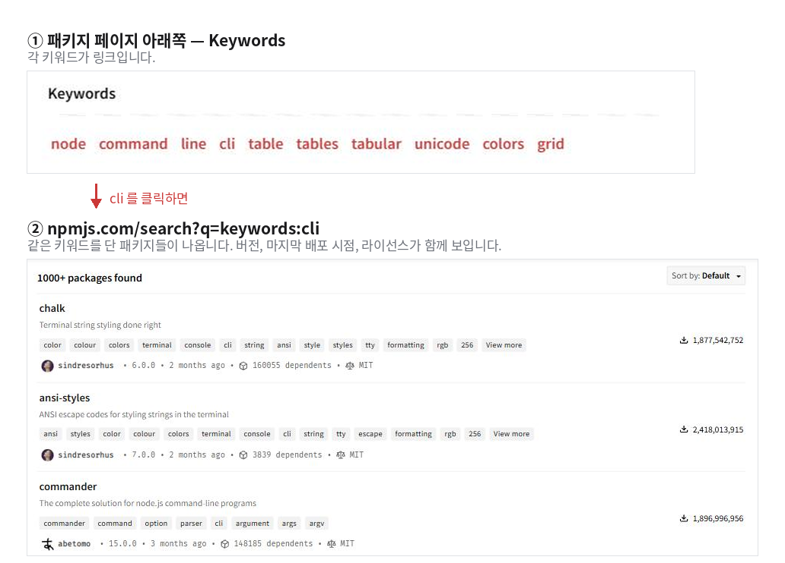

# A1 — npm 둘러보기

2주차 과제 · 5% · 마감 9/16(수) 23:59

## 제출 방법

별도 제출 절차는 없습니다. 본인 GitHub 계정에 아래 조건으로 저장소를 만들어 두면 됩니다.

- 저장소 이름: **`oss2026-a1`** (오타가 있으면 채점 대상에서 누락됩니다)
- 공개 범위: **Public**
- 계정: A0에서 제출한 그 계정

마감은 **마지막 커밋이 push된 시각** 기준입니다.

## 배경

2주차 실습에서 설치한 패키지는 `inko` 하나였습니다. npm에는 약 300만 개의 패키지가
등록되어 있습니다. 이번 주에는 그중 몇 개를 직접 찾아봅니다.

만들어야 할 프로그램은 없습니다. 둘러보다가 눈에 띈 패키지를 몇 개 고르고, 그것으로 무엇을
할 수 있을지 적고, 아직 관리되고 있는 패키지인지 확인하면 됩니다.

## 1. 둘러보기 (20분)

### 1-1. awesome-nodejs

출발점은 **awesome-nodejs** 입니다. <https://github.com/sindresorhus/awesome-nodejs>

Node 패키지를 49개 카테고리로 정리해둔 목록입니다. 상단 Contents에서 관심이 가는 카테고리를
두세 개 골라 훑어봅니다.

| | | |
|---|---|---|
| Command-line apps | Text | Date |
| Command-line utilities | Image | Math |
| Humanize | Parsing | Number |
| Natural language processing | Automation | Hardware |
| Filesystem | Compression | Streams |
| **Mad science** | **Weird** | Miscellaneous |

뒤의 두 개도 실제 카테고리입니다. 마땅히 고를 것이 없으면 이 둘부터 보면 됩니다.

### 1-2. `npm search` — 터미널에서 실행

VS Code에서 저장소 폴더를 열고 통합 터미널을 켭니다. 단축키는 `Ctrl` + `` ` `` 입니다.
(메뉴로는 `Terminal` → `New Terminal`)

이 수업의 터미널은 **Git Bash** 기준입니다. 터미널 패널 오른쪽 위 `+` 옆의 아래 화살표를 눌러
목록에서 `Git Bash`를 선택합니다. 아래 화면처럼 `MINGW64`가 표시되면 Git Bash입니다.

검색어는 아무 단어나 됩니다. 두 단어 이상이면 따옴표로 묶습니다.

```
npm search "cli table"
```

실행하면 아래와 같이 출력됩니다.



한 항목당 다섯 줄이고, 각 줄의 의미는 다음과 같습니다.

| 줄 | 내용 |
|---|---|
| 1 | 패키지 이름 |
| 2 | 한 줄 설명 |
| 3 | 버전, **배포 날짜**, 배포한 사람 |
| 4 | 관리자 목록 |
| 5 | 키워드 (항목에 따라 없을 수도 있습니다) |

3번 줄의 날짜를 눈여겨봅니다. 위 화면에도 2025년과 2016년이 함께 나와 있습니다.

다른 검색어 예시: `npm search "ascii art"`, `npm search "korean hangul"`,
`npm search emoji`, `npm search "terminal spinner"`

### 1-3. Keywords 링크 따라가기

npmjs.com에서 패키지 페이지를 열고 아래로 내리면, README가 끝나는 지점에 **Keywords** 목록이
있습니다. 각 키워드가 링크이고, 하나를 누르면 같은 키워드를 단 패키지들이 나옵니다.



검색 결과에는 이름과 설명뿐 아니라 **버전, 마지막 배포 시점, 라이선스, 다운로드 수**가 함께
표시됩니다. 어떤 패키지에 비슷한 대안이 몇 개나 있는지 확인하는 가장 빠른 방법입니다.

선정한 패키지들이 같은 카테고리에 속할 필요는 없습니다. 서로 관련이 없어도 됩니다.
20분 정도면 충분하며, 순서를 정해 체계적으로 볼 필요는 없습니다.

## 2. 눈에 띈 패키지 3개 선정

선정 이유는 무엇이든 괜찮습니다. 겪어본 문제를 해결해주어서, 이런 것이 가능한 줄 몰라서,
이름이 특이해서, 설명이 궁금해서 모두 해당합니다. 각각 한 줄로 이유를 적습니다.

## 3. 이것으로 무엇을 할 수 있을지

각각 두세 문장으로 적습니다.

- 현실성이나 유용성은 평가하지 않습니다
- 실제로 만들 계획이 없어도 됩니다
- 패키지의 기능을 잘못 짐작해도 상관없습니다. 무엇이라고 짐작했는지 그대로 적으면 됩니다

## 4. 관리되고 있는지 확인

선정한 패키지마다 터미널에서 아래를 실행하고, 출력을 그대로 붙여넣습니다.

```
npm view <패키지이름> version time.modified license dependencies
npm view <패키지이름> deprecated
```

두 번째 명령은 아무것도 출력되지 않는 것이 정상입니다. 출력이 있다면 그 패키지는 지원이
중단된 것이므로, 빈 결과도 그대로 붙여넣습니다.

그리고 한두 줄을 덧붙입니다. 예상과 달랐던 점이 있었는지, 마음에 들었던 패키지가 몇 년째
방치되어 있지는 않은지, 라이선스를 확인할 수 없거나 deprecated 상태는 아닌지 적습니다.

출력을 읽기 전에 알아둘 내용이 세 가지 있습니다.

- `time.modified`는 배포일이 아닙니다. 메타데이터만 바뀌어도 갱신됩니다.
  실제 배포일은 `npm view <패키지이름> time --json` 으로 확인합니다
- 오래되었다고 해서 방치된 것은 아닙니다. 한 가지 기능만 하는 작은 패키지는 완성된 뒤
  더 이상 수정하지 않는 경우가 있습니다
- 필드가 비어 있다고 해서 값이 없는 것은 아닙니다. 옛 형식으로 기록되어 npm이 읽지 못하는
  경우가 있으므로, 저장소를 직접 확인해봅니다

## 5. 하나 설치해서 다섯 줄 실행

선정한 것 중 아무거나 하나를 고릅니다.

```
npm install <그 패키지>
```

그 다음 `try.js`를 채웁니다. **import만 해서는 화면에 아무것도 출력되지 않습니다.**
패키지를 한 번 실제로 호출해서 결과가 나오는 것까지 확인해야 합니다. 사용법은 그 패키지의
npm 페이지나 GitHub README에 있는 예제를 보면 됩니다.

```js
import qrcode from "qrcode-terminal";
qrcode.generate("https://github.com", { small: true });
```

이런 형태로 import 한 줄에 호출 두세 줄, 다섯 줄이면 충분합니다.
`try.js` 안에 예시가 두 개 더 들어 있습니다.

`node try.js` 를 실행한 뒤 명령과 출력을 `REPORT.md`에 붙여넣습니다.

## 6. 막혔던 부분 (채점하지 않음)

에러 메시지든 헷갈렸던 부분이든 하나만 적습니다. 두 문장이면 충분하고, 없었으면 없었다고
적으면 됩니다. 다음 강의 보완에 참고합니다.

## AI 사용

허용합니다.

- 사용했다면 프롬프트를 `REPORT.md`에 붙여넣고, AI의 설명이 실제와 달랐던 부분이 있으면 적습니다
- 사용하지 않았다면 "사용하지 않음"이라고만 적으면 됩니다. 그 외에 추가로 적을 것은 없습니다

## 배점 (100)

| 항목 | 점수 |
|---|---|
| 3개 선정, 각각의 이유 | 25 |
| 각각의 활용 아이디어 | 25 |
| 각각의 `npm view` 출력과 그에 대한 해석 | 35 |
| `try.js` 실행, `dependencies`에 패키지 포함 | 15 |

6번은 채점하지 않습니다. 붙여넣은 출력이 실제 명령 결과와 다를 경우 재제출을 요구합니다.

## 채점 방식

제출물은 아래 순서로 확인합니다.

**1. 저장소를 찾아 clone합니다.**
A0에서 제출한 계정의 `oss2026-a1` 저장소를 받습니다. 이름이 한 글자라도 다르거나 Private이면
찾지 못하며, 제출하지 않은 것으로 처리됩니다.

**2. 저장소에 `node_modules` 폴더가 올라와 있는지 봅니다.**
올라와 있으면 감점합니다. 템플릿의 `.gitignore`에 `node_modules/`가 이미 들어 있으므로, 이
파일을 지우지 않았다면 문제가 없습니다. 터미널에서 `git status`를 실행해
`nothing to commit, working tree clean` 이 나오면 정상입니다.

**3. `npm install` 후 `node try.js`를 실행합니다.**
여기서 실행되지 않으면 `try.js` 항목 15점을 받지 못합니다. 다만 그 에러를 6번에 적어두었다면
6번은 그대로 인정합니다.

채점자는 `node_modules` 없이 받은 저장소에서 시작하므로, 같은 조건을 본인 컴퓨터에서 미리
만들어볼 수 있습니다. `node_modules` 폴더를 지우고 처음부터 다시 설치해보면 됩니다.

```
rm -rf node_modules
npm install
node try.js
```

**4. `REPORT.md`를 읽습니다.**
배점표의 나머지 85점은 여기서 채점합니다.

**5. 마지막 커밋의 push 시각을 확인합니다.**
마감 이후면 지각 처리합니다.
